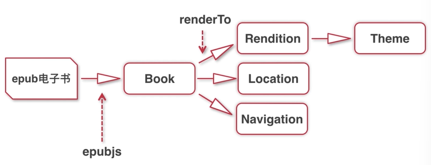

# Vue 3 + TypeScript + Vite+Epub.js

还在施工中ing

viewport

sass:	[Sass教程 Sass中文文档 | Sass中文网](https://www.sass.hk/docs/)

## epubjs 工作原理

epub -(epubjs)-> Book(object):

->

1. Rendition (Theme,包括排版，样式)
2. Location （电子书定位）
3. Navigation（电子书目录）